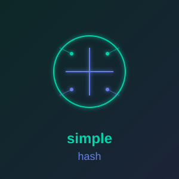

<p align="center">
  
</p>

# simple_hash

**[Documentation](https://simple-eiffel.github.io/simple_hash/)** | **[Watch the Build Video](https://youtu.be/Rh3KhoK_W5U)**

Lightweight cryptographic hashing library for Eiffel.

## Features

- **SHA-256, SHA-512** - Secure hashes (FIPS 180-4)
- **HMAC-SHA256, HMAC-SHA512** - Keyed-hash message authentication (RFC 2104)
- **SHA-1** - Legacy, for protocols that require it (WebSocket handshake)
- **MD5** - Legacy checksums (not for security)
- **Streaming file hashing** - 256 KB chunks, flat memory, no 2 GB limit, Unicode file names
- **Incremental hashing** - `SIMPLE_SHA256_STATE` and friends: feed data in pieces, then `finish`
- **Design by Contract** - Full preconditions/postconditions
- **EiffelBase only** - Block compression and file reads are inline C (Windows)

## Installation

Add to your ECF:

```xml
<library name="simple_hash" location="$SIMPLE_EIFFEL/simple_hash/simple_hash.ecf"/>
```

Set environment variable (one-time setup for all simple_* libraries):
```
SIMPLE_EIFFEL=D:\prod
```

## Usage

### SHA-256 Hashing

```eiffel
local
    hasher: SIMPLE_HASH
    digest: STRING
do
    create hasher.make

    digest := hasher.sha256 ("Hello, World!")
    -- Result: "dffd6021bb2bd5b0af676290809ec3a53191dd81c7f70a4b28688a362182986f"
end
```

### HMAC-SHA256 (for JWT, API signatures)

```eiffel
local
    hasher: SIMPLE_HASH
    signature: STRING
do
    create hasher.make

    signature := hasher.hmac_sha256 ("secret-key", "message")
    -- 64-character hex string
end
```

### File Hashing (streamed)

```eiffel
local
    hasher: SIMPLE_HASH
do
    create hasher.make
    -- 256 KB at a time: memory stays flat at any file size
    if attached hasher.sha256_file ("D:\data\big.iso") as h then
        print (h)
    end
    -- Unicode names: pass a STRING_32 or a PATH.
    -- A STRING_8 is taken as Latin-1 characters, NOT decoded as UTF-8.
    if attached hasher.sha256_file ({STRING_32} "notes\λόγος.md") as h then
        print (h)
    end
end
```

Every file feature answers `Void` if the file is missing, is a directory, cannot be opened or a read fails.

### Incremental Hashing

```eiffel
local
    state: SIMPLE_SHA256_STATE
do
    create state.make
    state.update ("first part, ")
    state.update ("second part")
    state.finish
    print (state.digest_hex) -- same as hasher.sha256 ("first part, second part")
end
```

### MD5 (Legacy only)

```eiffel
local
    hasher: SIMPLE_HASH
    checksum: STRING
do
    create hasher.make

    -- WARNING: MD5 is cryptographically broken
    checksum := hasher.md5 ("data")
end
```

## API Reference

### Hashing

| Feature | Description |
|---------|-------------|
| `sha256 (STRING): STRING` | SHA-256 hash as 64 hex chars |
| `sha256_bytes (STRING): ARRAY[NATURAL_8]` | SHA-256 hash as 32 bytes |
| `hmac_sha256 (key, msg): STRING` | HMAC-SHA256 as 64 hex chars |
| `hmac_sha256_bytes (key, msg): ARRAY[NATURAL_8]` | HMAC-SHA256 as 32 bytes |
| `md5 (STRING): STRING` | MD5 hash as 32 hex chars |
| `md5_bytes (STRING): ARRAY[NATURAL_8]` | MD5 hash as 16 bytes |
| `sha512`, `sha512_bytes`, `hmac_sha512`, `hmac_sha512_bytes` | SHA-512 family (128 hex chars / 64 bytes) |
| `sha1 (STRING): STRING`, `sha1_bytes` | SHA-1 (40 hex chars / 20 bytes) |

### File Hashing

| Feature | Description |
|---------|-------------|
| `sha256_file (READABLE_STRING_GENERAL): detachable STRING` | SHA-256 hex of a file, streamed |
| `sha256_file_bytes (READABLE_STRING_GENERAL): detachable ARRAY[NATURAL_8]` | SHA-256 bytes of a file |
| `sha256_path (PATH): detachable STRING` | SHA-256 hex of the file at a PATH |
| `sha512_*`, `sha1_*`, `md5_*` | The same three forms for each algorithm |

### Streaming States

`SIMPLE_SHA256_STATE`, `SIMPLE_SHA512_STATE`, `SIMPLE_SHA1_STATE`, `SIMPLE_MD5_STATE` (all `SIMPLE_HASH_STATE`):
`update (READABLE_STRING_8)`, `update_bytes (ARRAY[NATURAL_8])`, `update_from_managed (MANAGED_POINTER, INTEGER)`,
`finish`, `digest`, `digest_hex`, `reset`, `byte_count`.

## Performance

Finalized build on a Ryzen 9 7945HX, 1 GiB file (1.1.0 vs 1.0.0):

| | 1.0.0 | 1.1.0 |
|---|---|---|
| SHA-256 file, lean | 12 MB/s, 5,282 MB peak working set | 356 MB/s, 7 MB |
| SHA-256 file, with contracts | 0.88 MB/s (100 MB file) | 365 MB/s, 12 MB |
| SHA-512 / SHA-1 / MD5 file, lean | 15 / n.a. / 23 MB/s (100 MB) | 553 / 547 / 720 MB/s |

### Utilities

| Feature | Description |
|---------|-------------|
| `bytes_to_hex (bytes): STRING` | Convert bytes to hex string |
| `hex_to_bytes (hex): ARRAY[NATURAL_8]` | Convert hex string to bytes |

## Use Cases

- **JWT tokens** - HMAC-SHA256 for HS256 signatures
- **API authentication** - Request signing
- **Data integrity** - File checksums
- **Password hashing** - SHA-256 with salt

## Dependencies

- EiffelBase only (Windows: file reads use Win32 `CreateFileW`/`ReadFile` via inline C)

## License

MIT License - Copyright (c) 2024-2026, Larry Rix
